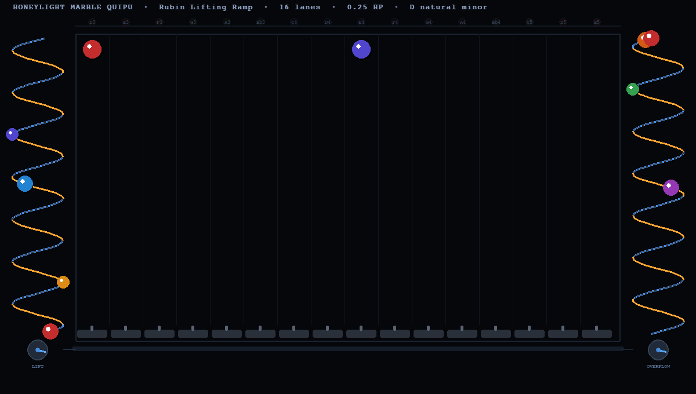

# Honeylight Marble Quipu

**Golf ball percussion instrument.  
Rubin Lifting Ramp · 16-lane solenoid actuator · Handpan tongue drum · LED Quipu bar · Raspberry Pi**

> *"The runners run in parallel."*  
> — Inca quipucamayoc, 600 years ago. Same pattern. New materials.

---



---

## What This Is

A marble-run music machine where golf balls are the score.

```
  ┌─────────────────────────────────────────────────────┐
  │         RUBIN LIFTING RAMP  (left)                  │
  │  Double helix A↑CW + B↑CCW · 0.25 HP · 5 ft lift  │
  │  Counter-rotating twin screws grip & carry balls up │
  └────────────────┬────────────────────────────────────┘
                   │ delivers to 16 lane tops
  ┌────────────────▼────────────────────────────────────┐
  │          16-LANE INSTRUMENT  (centre)               │
  │  Golf balls fall 5 ft through PVC channels          │
  │  IR sensors detect arrival at bottom                │
  │  Solenoid hammers strike handpan tongue drum        │
  │  WS2812B RGB LED Quipu bar flashes note colour      │
  │  Raspberry Pi Zero 2W is the quipucamayoc           │
  └────────────────┬──────────────────┬─────────────────┘
              play mode          bypass gate (G)
               ↓ tray                ↓ tray
  ┌────────────────▼──────────────────▼─────────────────┐
  │         OVERFLOW RAMP  (right)                      │
  │  Identical twin-helix, motor reversed — descends    │
  │  Rate tunable 0.1× – 8.0× via − / + keys           │
  └─────────────────────────────────────────────────────┘
```

---

## The Rubin Lifting Ramp

Two nested counter-rotating helical screws.  
Helix A rotates clockwise. Helix B rotates counter-clockwise.  
Golf balls sit in the **nip** between both surfaces — each surface pushes upward simultaneously.

This is distinct from an Archimedean screw (which moves fluid in a channel).  
The twin-screw nip **grips and lifts** like a ball between two spinning wheels, wound into columns.

```
  Motor:        0.25 HP  (186 W)
  Lift height:  5 feet
  Base RPM:     132  (10% surplus above musical fall rate)
  Max capacity: 190 balls/sec
  Musical rate: ~2 balls/sec  →  motor at <1% rated load
```

---

## The Quipu Connection

The Incas encoded information in knotted cord networks called **quipus**.  
Parallel pendant cords carried independent data streams.  
The **quipucamayoc** (reader) decoded them.

This instrument is structurally identical:

| Inca Quipu | Marble Quipu |
|---|---|
| Pendant cords (parallel) | Ramp lanes (parallel channels) |
| Knot position on cord | Golf ball height (encodes time) |
| Cord colour | Lane LED colour (encodes pitch) |
| Quipucamayoc (reader) | Raspberry Pi + solenoids |
| Runner carrying the quipu | Gravity |

**600 years. Same pattern.**

---

## Simulator

Three simulators included, from prototype to full system:

| Script | Description |
|---|---|
| `honeylight_full.py` | ⭐ **Full system** — Rubin Lifting Ramp + 16 lanes + Overflow. Gate + tunable overflow. |
| `honeylight_proto.py` | 4 ft × 8 ft prototype — 16 lanes, 16 hammers, Ode to Joy |
| `honeylight.py` | Original sim — LED quipu bar, marbles, waveform |

### Run

```bash
git clone https://github.com/MarkIanRubin/honeylight-marble-quipu
cd honeylight-marble-quipu
pip install pygame-ce numpy pillow
python3 honeylight_full.py
```

### Controls

| Key | Action |
|---|---|
| `G` | Toggle gate: Play instrument ↔ Bypass to overflow |
| `−` / `+` | Decrease / Increase overflow rate |
| `SPACE` | Pause / Resume |
| `R` | Restart song |
| `CLICK` lane | Drop ball manually |
| `1–9, 0` | Drop in lanes 1–10 |
| `Q W E T Y U` | Drop in lanes 11–16 |
| `ESC` | Quit |

---

## Physics

```
Golf ball:         1.68 in dia · 1.62 oz (45.9 g)
5 ft drop:         620–720 ms fall time
Min ball spacing:  247 ms per lane  →  8th notes @ 121 BPM
Motor:             0.25 HP = 186 W · lifts 190 balls/sec theoretical max
Musical rate:      ~2 balls/sec total  →  1.5 W draw  (<1% motor load)
Noise threshold:   >12 simultaneous notes on single sustained instrument
Sweet spot:        4–6 simultaneous lanes · 60–120 BPM
Upper limit:       16 lanes = string quartet = all coherent music
88 lanes:          all human music ever written — a waterfall
```

---

## Hardware (Prototype BOM — $2,431 total)

See [`Honeylight_Quipu_Parts_List.md`](Honeylight_Quipu_Parts_List.md) for the complete 213-item parts list.

Key components:

| Section | Item | Cost |
|---|---|---|
| Instrument | "Handpan" Tongue Drum, Used Mint — Reverb #86815164 | $325 |
| Frame | 4 ft × 8 ft × 8 in, dimensional lumber | $209 |
| Enclosure | 1/4" clear acrylic front panel + sides | $362 |
| Lanes | 16 × PVC channel, 96 golf balls, return tray, lift motor | $259 |
| Hammers | 16 × JF-0530B solenoid + rubber tips + aluminum arch | $181 |
| Brain | Raspberry Pi Zero 2W + ULN2803A + IR sensors | $113 |
| LED | WS2812B quipu bar + aluminum channel + diffuser | $52 |
| Audio | Contact pickup + condenser mic + 30W amp + speakers | $249 |
| Solar | 100W panel + MPPT controller + 50Ah LiFePO4 battery | $343 |

---

## Roadmap

| Version | Description | Status |
|---|---|---|
| v0 | Simulator — honeylight_full.py | ✅ Done |
| v1 | Physical build — 4×8 frame, golf balls, 0.25HP Rubin ramps | 🔨 Building |
| v2 | Hybrid two-axis gimbal actuator — theatrical rotating arm | 📐 Designed |
| v3 | Two instruments, two canons playing simultaneously | 🪢 Planned |
| v4 | 88 lanes — full chromatic range, all human music | 🌌 Vision |

---

## Location

Honeylight Farm · Potomac MD 20854  
Goat enclosure, solar powered, outdoor installation.  
Queenbee Workbench · `/Users/queenbee/chromatic-roll/`

---

*Mark Rubin / Honeylight*  
*"The runners run in parallel."*
